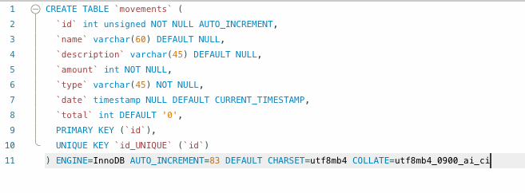

# Hi! #

## Conscious GetBy

HTML | CSS |Tailwind | JavaScript | Vue.js | RouterView | Node.js | MySQL

It is a first raw version of a personal money manager, a mix with a moneybox  and an accounting book.
- Ideas for further development: 
    - Create a unique table for savings, and be able to relate it to objectives with the intention to be able to save money for specific objectives.
    - Eliminate erroneous movements, with a negative or positive movement as appropriate. 
    - Proper reponsive version and different views with menu and it's deployment.

https://github.com/estelcm/BoxMoney_fullstack/assets/118080271/22f2ca36-c5d4-4d97-95de-83d6d81d061b

## Author
- [@estelcm](https://github.com/estelcm)

## 🔗 Links

## Deployment

To deploy this project run:
npm i (node js)
npm run dev
npm start

MySQL --> Create a schema 'moneyBox'

